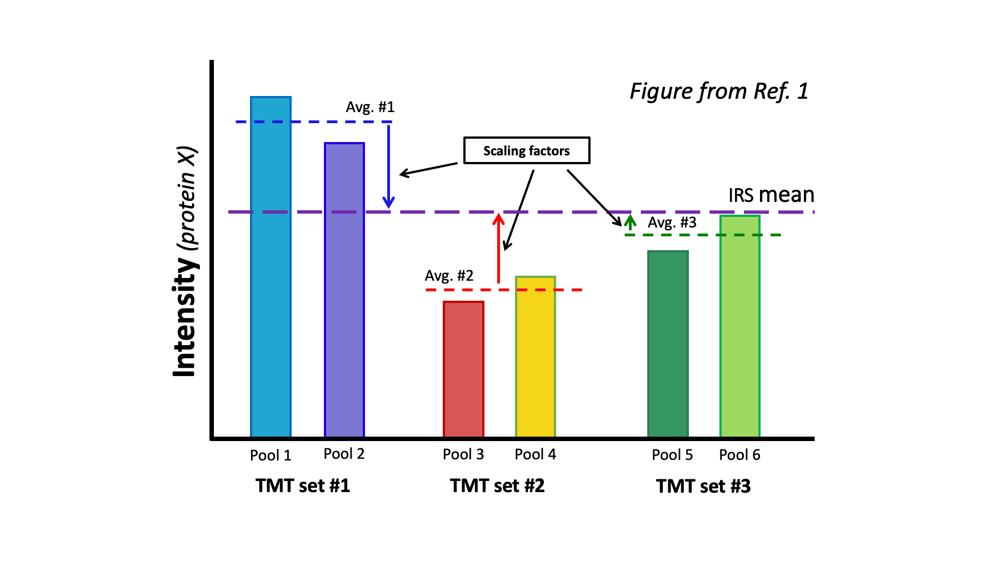
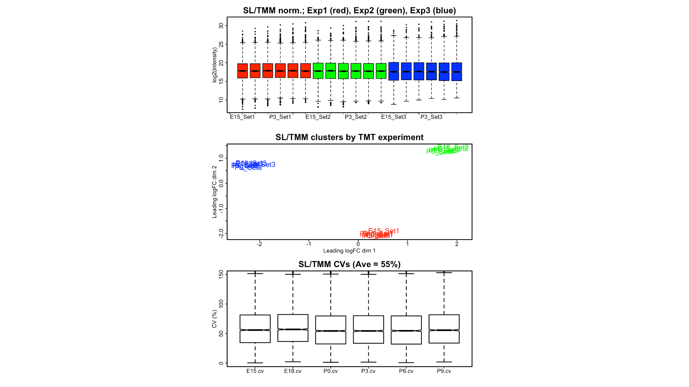
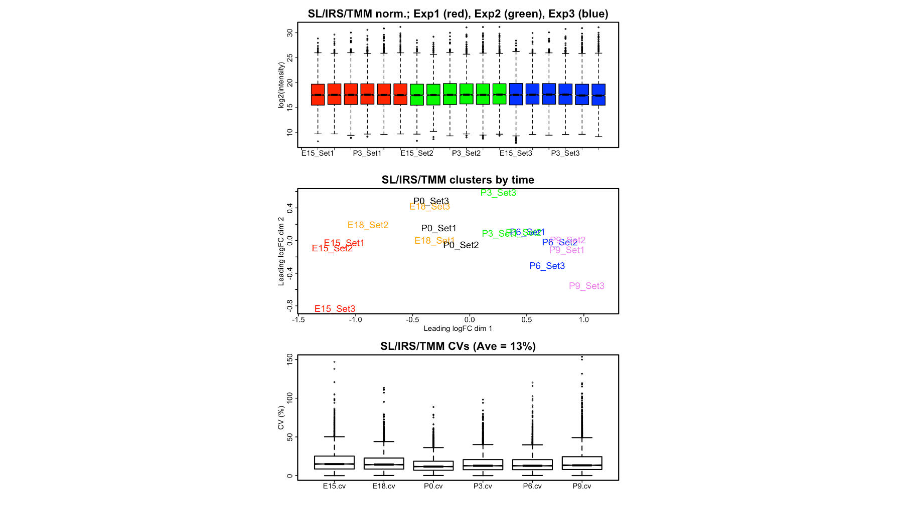
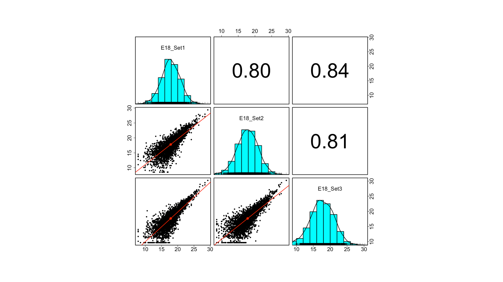
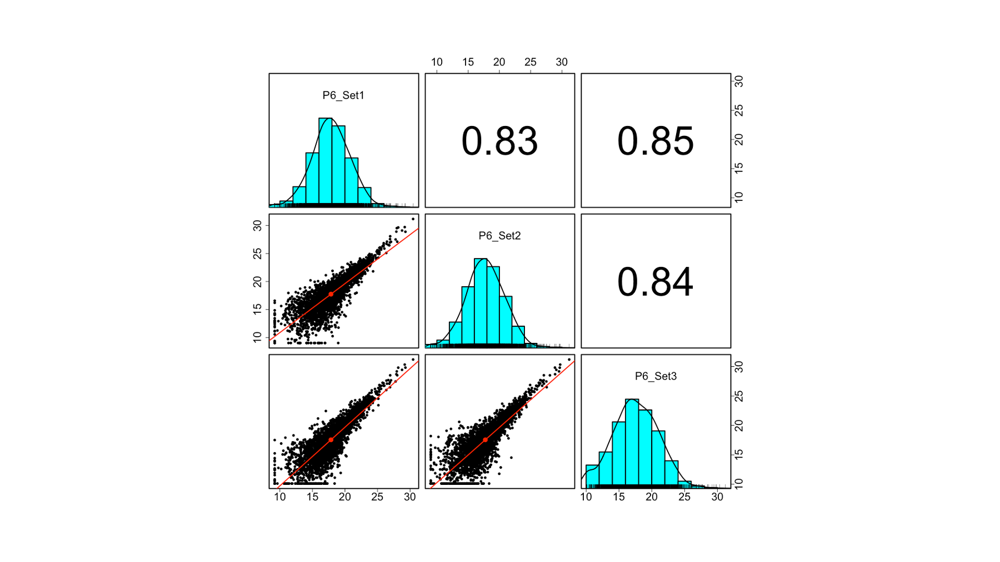
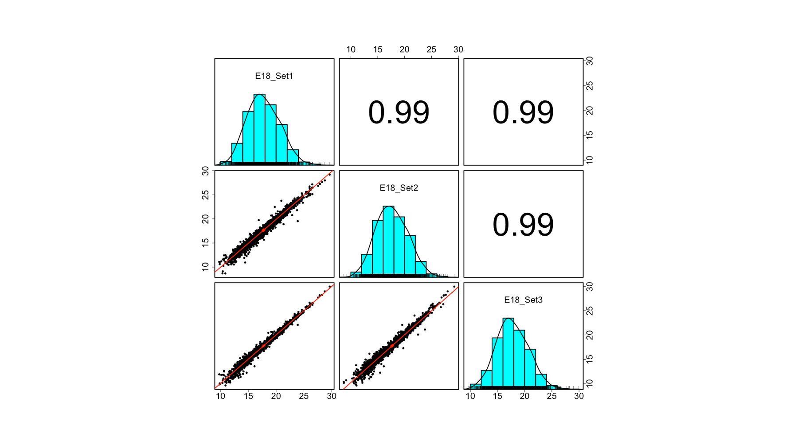
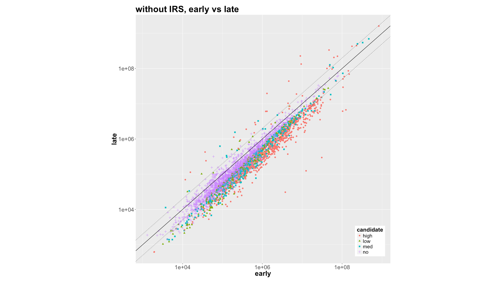
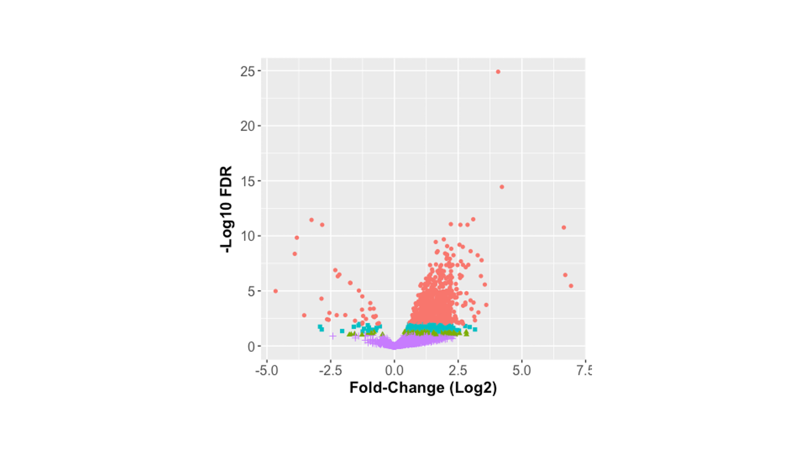
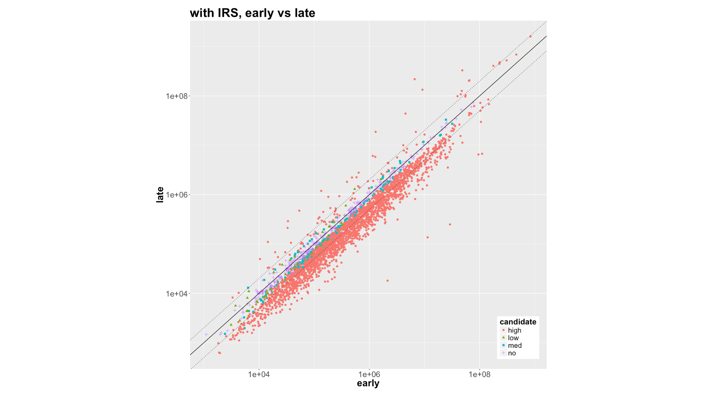
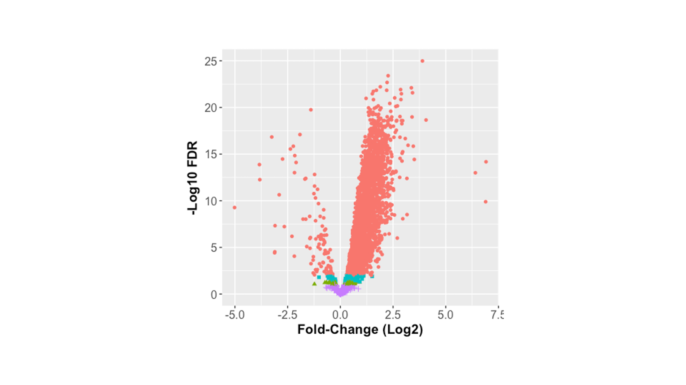

# ASMS_2018

## Poster presented at 2018 San Diego ASMS meeting

### Thursday Poster 389.

---

#### Left Panel

Many biological studies will have more than 11 samples and need more than one TMT experiment (a labeling kit or TMT plex). We have pretty good methods for adjusting (normalizing) reporter ions within a single TMT experiment. Those methods typically **fail** when adjusting reporter ions **between** multiple TMT plexes ([Ref. 1](https://www.mcponline.org/content/16/5/873.short)).

> 1. Plubell, Deanna L., et al. "Extended multiplexing of tandem mass tags (TMT) labeling reveals age and high fat diet specific proteome changes in mouse epididymal adipose tissue." Molecular & Cellular Proteomics 16.5 (2017): 873-890.

The most popular type of sample to evaluate quantitative proteomics methods is one where a subset of proteins at known relative expression levels are spiked into a complex background. However, to recover the known expression levels, the data already needs to be properly normalized. To evaluate normalizing multiple TMT plexes, we need complex biological samples labeled with TMT reagents that were spread over multiple TMT plexes. Ideally, we want a biological system where we have extensive prior knowledge from many other types of studies so that we can make educated guesses as to what properly normalized data should look like.

Last year, a time course study of developing mouse lens was published ([Ref. 2](https://iovs.arvojournals.org/article.aspx?articleid=2670138)). The lens is a well studied system with unusual composition. There is a monolayer of epithelial cells on the anterior face of the lens. As those cells divide, cells are pushed to the periphery (the equator) where signaling factors trigger differentiation into fiber cells. Fiber cells elongate and over-express a small number of lens specific proteins such as crystallins. Fiber cells do not turn over and new fiber cells are laid down over existing fiber cells. As the lens develops and grows, the lens-specific proteins in mature fiber cells increasingly dominate the composition of the lens. See [this Wikipedia entry](https://en.wikipedia.org/wiki/Lens_%28anatomy%29) for more details.

> 2. Khan, Shahid Y., et al. "Proteome Profiling of Developing Murine Lens Through Mass Spectrometry." Investigative ophthalmology & visual science 59.1 (2018): 100-107.

The developmental study had two embryonic time points (E15 and E18) and four postnatal time points (P0, P3, P6, and P9), all 3 days apart. There were three biological replicates at each time point. It was a balanced study design where each set of 6 time points was analyzed in its own separate 10-plex TMT run. The data were generated on a Thermo Lumos using the SPS MS3 method, and analyzed with Proteome Discoverer 2.1. Reporter ion peak heights (intensities) were used instead of the default signal-to-noise ratios. Note that the signal-to-noise ratio is a unit-less, compressed value that does not seem to reflect analyte abundance. An export file of protein total reporter ion intensities from the Supplemental materials was processed for this work. There were 3155 proteins detected in all three TMT plexes.  

There were no common reference channels repeated in the TMT experiments. Given the balanced study design, multiple mice lenses pooled at each time point, and lower biological variance of laboratory animal strains, an average of the reporter ion intensities for each protein within each TMT plex was used as an approximation for true reference channels.

Most quantitative proteomics workflows need **multiple** sequential normalization steps rather than a single one. This work will examine three normalization methods. The first is to correct for sample processing and labeling discrepancies and will be referred to as **sample-loading (SL)** normalization. The reporter ion signals are a proxy for protein abundances. The sum of all reporter ions in each sample (a given channel) should be proportional to the total amount of protein that was labeled. Therefore, the grand total of each channel's reporter ions should be the same, since we labeled equal amounts of protein in each sample.

SL normalization is a single factor scaling to make the sums of each channel all be equal to the average sum. This is to keep the reporter ion intensities as close to their original values as possible. This step should always be done to TMT data first. It makes the starting reporter ion data consistent with the bench protocol instructions. We do not want the protein assay, digestion, and labeling sources of variation to potentially confound any subsequent normalization steps.

There can be compositional bias in biological samples and, due to the constrained designs (equal total amount), this can bias gene/protein expression. The **trimmed mean of M values (TMM)** method ([Ref. 3](https://genomebiology.biomedcentral.com/articles/10.1186/gb-2010-11-3-r25)) was developed for next generation sequencing data and is part of the edgeR package ([Ref. 4](https://academic.oup.com/bioinformatics/article/26/1/139/182458)). This is an implementation of the idea that most genes/proteins are not differentially expressed in many (but not all) studies. The method identifies the likely unchanged genes/proteins and applies single factor scaling to make those gene/protein expression values more similar to each other.

> 3. Robinson, Mark D., and Alicia Oshlack. "A scaling normalization method for differential expression analysis of RNA-seq data." Genome biology 11.3 (2010): R25.

> 4. Robinson, Mark D., Davis J. McCarthy, and Gordon K. Smyth. "edgeR: a Bioconductor package for differential expression analysis of digital gene expression data." Bioinformatics 26.1 (2010): 139-140.

The last normalization method corrects for the random sampling in shotgun proteomics ([Ref. 5](https://pubs.acs.org/doi/abs/10.1021/ac0498563)) and is called **internal reference scaling (IRS)** normalization ([Ref. 1](https://www.mcponline.org/content/16/5/873.short)). The high precision in isobaric labeling is due to the fact that all of the reporter ion intensities are measured in the same instrument scan. If an MS2 scan is triggered at lower analyte levels, the reporter ions will be less intense than if the scan occurred at a higher analyte abundance. The relative abundances of the reporter ions within a given scan are independent of when the MS2 scan was triggered. Summing the reporter ions from different PSMs into protein totals preserves the relative reporter ion precision within a single TMT experiment. This is not true for reporter ions **between** TMT plexes. The sets of reporter ion intensities for each TMT plex can vary quite dramatically for the same proteins between TMT plexes due to the collective random sampling.

> 5. Liu, H., Sadygov, R.G. and Yates, J.R., 2004. A model for random sampling and estimation of relative protein abundance in shotgun proteomics. Analytical chemistry, 76(14), pp.4193-4201.

If we use one or two channels in each TMT plex to label the exact same sample (an internal reference), this serves as a measuring stick for each individual protein in each TMT plex. Since this is (typically) an identical sample, we should expect to have the measuring stick give the same value in each TMT plex.

---

**Figure 1.** IRS computes scale factors from pooled standards to adjust all reporter ion channels to a common intensity scale.

---

The method (shown in the diagram above) takes the average of any reference channels in each TMT and computes a study-wide average (what the "same" value should be) and scales **each protein** to the study-wide average. This scale factor is applied to all channels in each TMT plex.

> The scale factors are derived from only the reference channels but applied to **all** channels. This keeps the biological samples independent of the correction samples and does not make any assumptions about study designs.

This levels out the reporter ion intensities between TMT plexes and removes the random MS2 sampling effect from the reporter ion intensities. Note that the reference channel is **not** used to compute ratios. The intensities are aligned using their natural total protein intensity scale. This preserves some rough indications of relative protein abundances within the samples. Natural intensities (or the log of intensities) are more compatible with downstream statistical testing that are ratios.

#### Center Panel

---

**Figure 2. Left Panel:** After SL and TMM normalization, reporter ion intensity distributions are horizontally aligned (top). However, samples incorrectly cluster by TMT experiment (center) and median CVs are larger than 50% (bottom).

---

In the left panels of Figure 2, we apply the sample loading normalizations and the trimmed mean of M values normalizations to the 18 samples from the three TMT plexes. The boxplots of the log2 protein intensities (upper panel) are very nicely horizontally aligned. Boxplots are a common way to evaluate normalizations and horizontal alignment is considered an indication of successful normalization. In genomics, it is now recognized that there can be hidden batch effects and that clustering plots are important to consider. When normalization methods have removed measurement artifacts, samples should group by biological condition. In this case, that would be by developmental time points. However, the center panel shows strong clustering by TMT experiment in the multi-dimensional scaling plot. The lower panel shows the distributions of protein coefficient of variance (CV) plots and the average median CV is 55%, a very large value for TMT data.

---

**Figure 2. Right Panel:** After SL, IRS, and TMM normalization, reporter ion intensity distributions are horizontally aligned (top). Samples now correctly cluster by developmental time point (center) and median CVs are reduced to 13% (bottom).

---

In the right panels of Figure 2, we have added the IRS normalization step using the average intensities within each TMT plex as "mock" reference channels. Interestingly, the boxplots (upper panel) look no different. The global distribution of protein intensities does not probe the variance at the individual protein levels. The effect of random MS2 sampling is hidden in many global data summaries like boxplots. The center clustering plot now shows that the samples group by developmental time (in the first dimension) and the TMT batch effect is gone. The bottom CV plot shows a dramatic improvement to an average median CV of 13%.

We can also examine how similar the biological replicates at each time point are to each other using scatter plots and correlation coefficients.

---

**Figure 3. Left Panel:** Intra-replicate scatter plots and correlation coefficients before IRS. The top plots are for embryonic 18-day samples and the bottom plots are postnatal day 6 samples.

---

Figure 3 (above) shows two of the 6 developmental time points. The top set of plots are the E18 time and the bottom set of plots are the P6 time. These plots are before IRS. The scatter plots are below the diagonal distribution plots and have linear trend lines in red. The correlation coefficients are above the diagonal plots. The diagonal shows the log2 intensity distribution as a histogram and rugplot. The left plots show that there is very high protein-to-protein variability between biological replicates if the IRS step is not applied.

---

**Figure 3. Right Panel:** Intra-replicate scatter plots and correlation coefficients after IRS. The top plots are for embryonic 18-day samples and the bottom plots are postnatal day 6 samples.

---

The protein variance is dramatically reduced by IRS normalization (above plots) and the correlations between biological replicates are now very high. This reduction in variance (noise) has profound effects on statistical testing significance (p-values).

#### Right Panel   
A 6-point time course study requires a complicated statistical analysis. If we create an "early" time point by combining the E15 and E18 samples, we can compare that to a "late" time point (combining P6 and P9 samples). Because of what we know about lens development, we can predict the outcome of this simpler comparison. The early condition will have a greater proportion of epithelial proteins (a large number of cellular proteins). The late condition will have dramatically altered composition where lens-specific proteins are at much higher expression levels and all other proteins will be diluted and be at greatly reduced expression levels. We are not applying the TMM normalization step here. We want to keep the compositional bias so that we can predict the statistical testing outcome.

There are statistical testing packages available in R that are optimized for small replicate number studies (limma and edgeR, among others). EdgeR ([Ref. 4](https://academic.oup.com/bioinformatics/article/26/1/139/182458)) was used to compare the 6 early time points to the 6 late time points. The variance estimates (moderated test statistics) were derived from the full set of 18 samples.

---

**Figure 4. Top Panel:** The edgeR package was used to identify differentially expressed proteins for the data without the IRS step. The top plot is a scatter plot with DE candidates color coded. The bottom plot are the same data in a Volcano plot.

---

The top panel shows a scatter plot of the average protein intensity for the early condition on the x-axis and the average intensity for the late condition on the y-axis for the data without the IRS step. The plot is log scale. Benjamini-Hochberg corrected p-values (FDR) are categorized into low (between 10% and 5%), medium (between 5% and 1%), and high (less than 1%) significance levels and colored by levels. The diagonal line is the 1-to-1 expression trend line. The dotted lines are plus/minus 2-fold change lines. Most proteins are down-regulated (below the diagonal) with a small number of up-regulated proteins. The results of the statistical testing (at a 5% FDR cutoff) are summarized in the lower right corner. We do sort of see the expected result, there are a few up regulated proteins and many more down-regulated proteins. However, there are too many (2020) non-differentially expressed proteins. The true number could be zero in lens. The differential candidates are not very well separated by color and the volcano plot in the upper left corner shows a compressed range of p-values. The statistical tests with the large pre-IRS protein variance data do not result in as many small p-values as they should.

---

**Figure 4. Bottom Panel:** The edgeR package was used to identify differentially expressed proteins for the data after the IRS step. The top plot is a scatter plot with DE candidates color coded. The bottom plot are the same data in a Volcano plot.

---

The lens developmental picture from the data after the IRS method (above) is completely different. The scatter plot is log scale with average intensities for early and late conditions. The colored points associated with different statistical significance levels are now well separated. The numbers of up and down regulated proteins are also very different. There are 121 up regulated lens-specific proteins and 2629 down-regulated proteins. Importantly, there are now only 405 non-differentially expressed proteins. The volcano plot is also very much improved. **This is the expression pattern that is known from decades of lens study.** The only difference between the upper panel and the lower panel is the additional IRS normalization step. The starting sample-loading-normalized data, and the statistical testing were the same.

IRS normalization is a unique normalization required in multiple TMT experiments. It specifically corrects for random MS2 sampling. In some ways, this resembles typical batch correction steps in genomics experiments. Some key differences are that there is no modeling *per se*. There is a directly calculable scaling factor for each protein in each TMT plex. Furthermore, the data undergoing statistical testing is not used to compute the scaling factors (no confounding of batch corrections and differential expression testing).

There is much more information present at my [GitHub repository](https://github.com/pwilmart/IRS_normalization.git). The information is presented in greater detail in [Jupyter](http://jupyter.org/) notebooks. Those notebooks also contain the R scripts for performing the analyses and visualizing the results.

---

The poster explains how to match reporter ion intensities (typically summed into protein totals) between multiple TMT experiments. Many study designs will exceed the current capacity (11 channels) and multiple TMT experiments will be needed to accommodate the samples. The poster file is `ASMS_poster_2018_3.pptx` or `Wilmarth_ASMS_poster_2018.pdf`.

The other repositories at [**github.io/pwilmart**](https://github.com/pwilmart) have many more details and cover a wider range of isobaric labeling analysis topics than the poster. I will be happy to answer any questions via email (wilmarth@ohsu.edu).

---

-Phil W., June 10, 2018.
